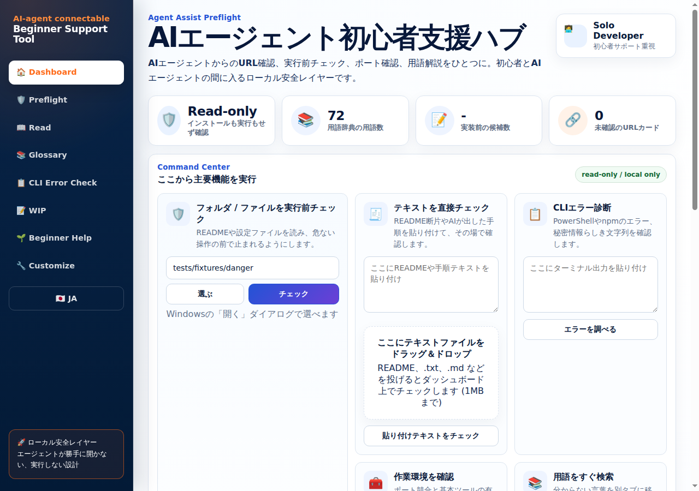
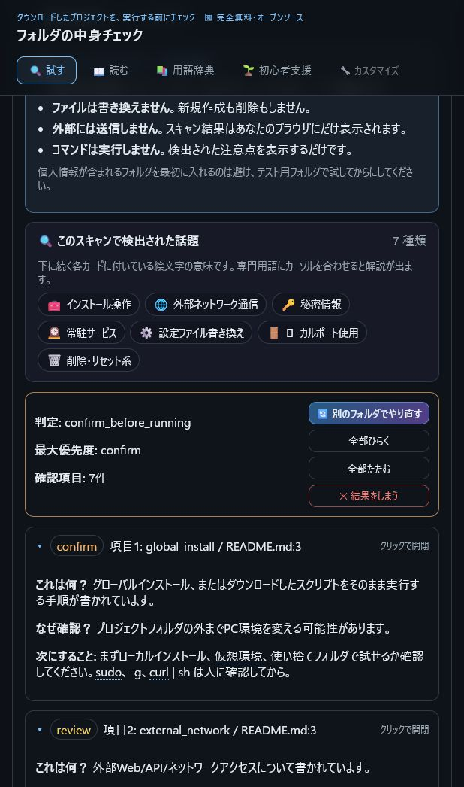
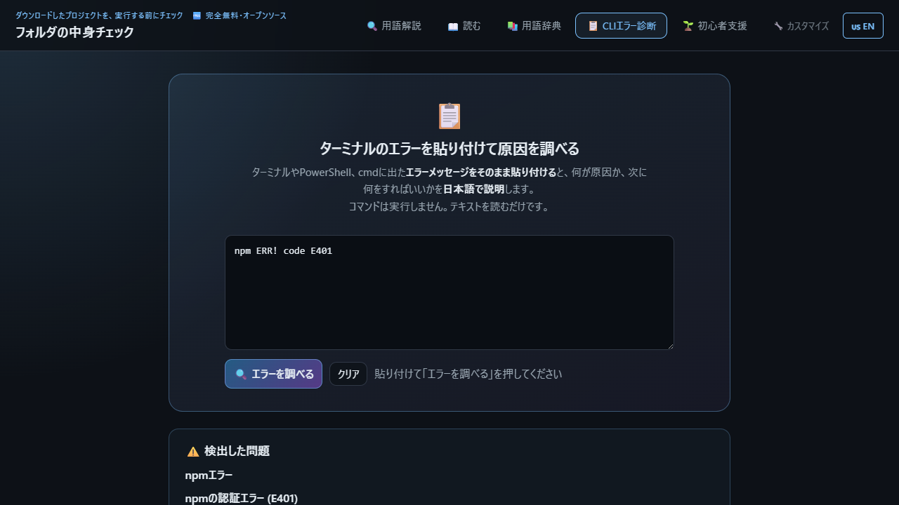

# Agent Assist Preflight / AIエージェント初心者支援ツール

[](https://github.com/CowBe11/agent-assist-preflight/actions/workflows/ci.yml)

[日本語 README](README.ja.md) | `v0.2.3` | Free · Open Source · Local Only

---

> **Your eyes between the agent and your machine.**
>
> A local preflight and review layer for people using Claude Code, Cursor, Codex, OpenCode, ChatGPT, Hermes, or other AI agents on real projects.

Agent Assist Preflight gives you one calm review screen before an AI agent, README, or terminal error pushes you into doing something risky or confusing. The Japanese name is shown in the title because this tool is meant to stay approachable for Japanese beginners too.

It is for moments like these:

- An agent says: “Please open this URL.”
- A README says: `curl | sh`, `npm install -g`, `pip install`, or “start a daemon.”
- A terminal error is full of secrets, tokens, paths, and scary words.
- You are in WSL, a CUI session, or a container and browser handoff keeps failing.
- You want a beginner-readable explanation before you continue.

```text
Agent / README / terminal error
        ↓
Agent Assist Preflight, running locally
        ↓
Readable review card
        ↓
You decide: open, copy, ignore, paste, or stop
```

## Try it in 60 seconds

No installer and no account are required. Clone it, then start the local WebUI:

```bash
git clone https://github.com/CowBe11/agent-assist-preflight.git
cd agent-assist-preflight
```

**Windows:** double-click `起動する.bat`.

**WSL / macOS / Linux:**

```bash
python3 management_webui/server.py
```

Then open `http://127.0.0.1:8765/`. The first useful test is to point Folder / README Preflight at a repo you were about to set up.

## Start here

| If you want to... | Use this |
|---|---|
| Let an agent ask you to open a page without controlling your browser | **URL card** |
| Paste an error into ChatGPT / Claude without leaking secrets | **Error reformatter + secret masker** |
| Check a downloaded repo before running its setup steps | **Folder / README preflight** |
| Understand terms like `daemon`, `PATH`, `pip`, `npm`, `secrets_or_auth` | **Glossary** |
| Check Python, pip, PATH, ports, and local agent-tooling mismatches | **Local WebUI checks** |

## The main idea: URL cards

This is the flagship workflow.

AI agents often cannot — and often should not — directly control your browser. Agent Assist Preflight lets the agent send only two things to a local endpoint:

1. the URL
2. why it wants you to open it

The WebUI shows a URL card. You read the reason, then choose:

- **Open in browser**
- **Copy URL**
- **Ignore**



```text
Agent → local API → URL card → you decide → browser opens only if you approve
```

The agent does not silently open your browser. It does not receive browser-control privileges. You stay in charge.

## What it also checks

### Error reformatter & secret masker

Paste a messy terminal or PowerShell error. The tool masks likely API keys, tokens, passwords, and other secrets locally, then turns the error into a clean prompt you can review before pasting into an AI chat.

### Folder / README preflight

Before running a downloaded project, scan README and config-like text files for review items such as:

- global installs / `curl | sh`
- secrets, tokens, auth, billing, or payment references
- daemon / service / cron instructions
- config mutations for agent tools
- containers, ports, browser control, external network access, and file writes

Result levels:

- `no_review_items_found` — nothing obvious was flagged; this is not a safety guarantee
- `review_before_trying` — worth reading before you proceed
- `confirm_before_running` — stop and ask someone before going further

### Glossary for scary terminal words

Beginner-hostile labels and CLI words are explained as:

- **What is this?**
- **Why does it matter?**
- **What should I do next?**

## Safety posture

Agent Assist Preflight is intentionally modest. It is **not a security scanner** and does **not** prove that a project is safe.

It is designed to be:

- **read-only toward inspected projects** — commands found in a target repo are never executed
- **local-only** — the WebUI binds to localhost
- **fixed diagnostics only** — the WebUI may run predefined read-only environment checks
- **no dependency installation**
- **no automatic external sending**
- **no silent browser control**

False positives and missed items are possible. The goal is not a perfect safety verdict. The goal is **a readable pause before running anything**.

## Screenshots

Current screenshots:

### Folder / README preflight



### CLI error paste checker



URL card, glossary, and `--format markdown` screenshots are planned. They are not linked here until image files exist, so the README does not contain broken screenshot links.

---

## Quick start

### Windows WebUI

Double-click:

```bat
起動する.bat
```

This launcher starts the local Python WebUI. It does not install dependencies, change settings, or contact external services. Its job is to check that Python exists, set UTF-8 output, run `standalone.py`, and pause so you can read any startup message.

A second Japanese convenience launcher also exists:

```bat
フォルダの中身チェックを起動する.bat
```

That file simply calls `起動する.bat`.

If your browser does not open automatically, open:

```text
http://127.0.0.1:8765/
```

> Check if Python 3 is installed: run `python --version` or `python3 --version` in Command Prompt.

### WSL / macOS / Linux WebUI

```bash
python3 management_webui/server.py
```

Then open:

```text
http://127.0.0.1:8765/
```

### CLI

```bash
# Check a folder
python3 preflight_checker.py ./my-project --format markdown

# JSON output
python3 preflight_checker.py ./my-project --format json

# Exit with an error code if confirm items are found
python3 preflight_checker.py ./my-project --fail-on confirm

# Version check
python3 preflight_checker.py --version
```

After package installation:

```bash
agent-assist-preflight ./my-project --format markdown
```

---

## Beginner workflow

1. Run the WebUI or CLI against the candidate project folder.
2. Read the plain-language summary first.
3. For each review item, read: what it means / why it matters / what to do next.
4. Do not paste real tokens, payment info, agent config changes, or global installs into an agent workflow until you understand the flagged item.
5. When possible, test in a throwaway folder or isolated environment first.

See [docs/beginner-guide.md](docs/beginner-guide.md) for a longer walkthrough.

---

## Local API for agent integration

Once the WebUI is running, a local API is available at:

```text
http://127.0.0.1:8765/api
```

Ground rules: **local-only · read-only toward inspected projects · fixed read-only diagnostics only · no automatic external fetching**.

The URL card feature is available through the local API. The intended flow is:

```text
POST /api/url-card { url, reason }
```

The agent asks. The user reviews. The user decides.

---

## Roadmap

**Highest priority:**

- Dashboard GUI and URL-card-first workflow polish

**Planned safety-layer features:**

- Agent config scan for `CLAUDE.md`, `agents.md`, `.cursorrules`, `.cursor/rules`, and `.github/copilot-instructions.md`
  - flag suspicious instructions, excessive permissions, external sending, or secret requests
- Token explosion / infinite loop warning
  - flag whole-directory reads, huge logs, `node_modules`, `.venv`, `dist`, `build`, and settings that may cause runaway reads
- Dangerous dependency / trap command detection
  - flag `curl | sh`, `sudo`, global installs, external port exposure, and access hints for `~/.ssh`, `.env`, or token files
- Secret sending prevention
  - stronger detection for `.env`, API keys, SSH keys, OAuth tokens, billing, and payment references

**Future exploration:**

- Command confirmation card ✅ Implemented (`POST /api/check-command`)
  - Agent asks for risk assessment before running a command. Returns low/medium/high risk with summary, ok_to_continue flag, and user_attention level. Low-risk commands (e.g. `git status`) pass through silently. Medium-risk (e.g. `pip install`) return optional guidance. High-risk (e.g. `rm -rf`) require WebUI review.
  - Response includes `risk`, `summary`, `ok_to_continue`, `user_attention`, `card_url`. Agent checks `ok_to_continue` to decide whether to proceed.
  - On denial, a hint is returned so the agent can improve the explanation and retry (learning loop).
  - WebUI shows a command history panel. Only high-risk cards get a prominent alert.
  - Configurable mode: silent (history only) / smart (default, risk-based) / strict (always confirm) / off.
  - Future: copy-paste question generation (Phase 2), agent callback (Phase 3, requires ecosystem support).

**Additional planned improvements:**

- more CLI error patterns: pip, cargo, docker, systemctl
- stronger cloud and chat secret masking: AWS, Azure, GCP, Slack, Discord
- improved multilingual terminal-error explanations
- mobile layout improvements
- optional local AI handoff only with explicit user action, masked text, confirmation screen, read-only mode, and no tool privileges

---

## License

MIT — free to use.

---

*This tool exists so that people new to AI agents can take a breath before running anything. It does not guarantee safety. It helps you receive an agent's suggestion, read the reason, and decide whether to open, ignore, or stop.*
